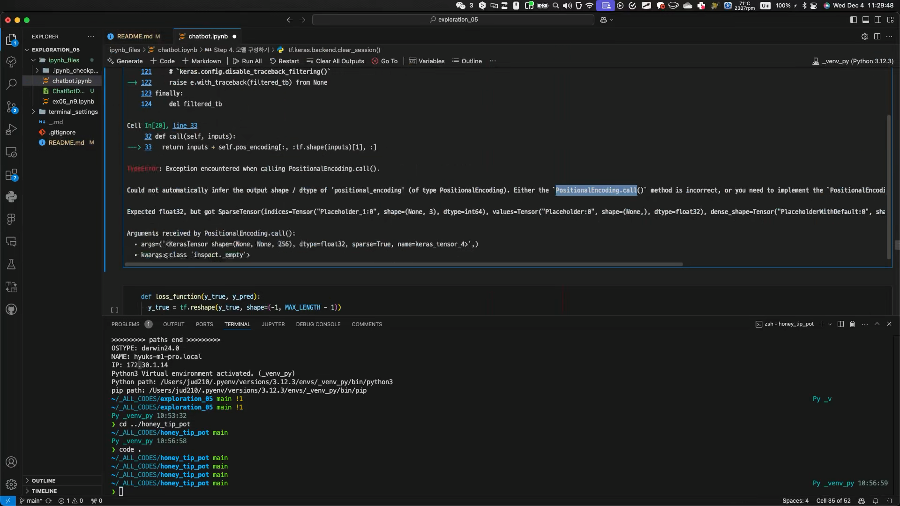
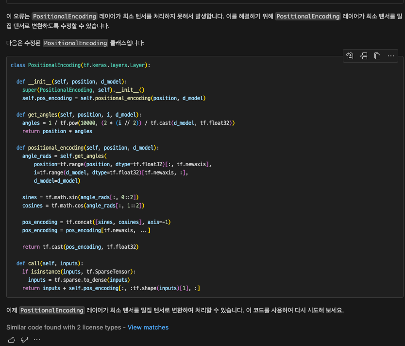
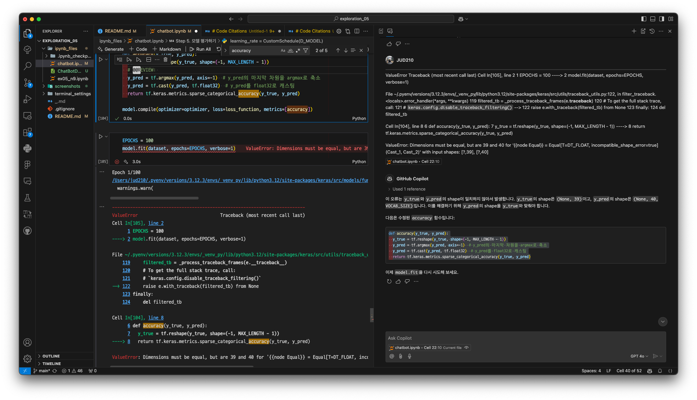
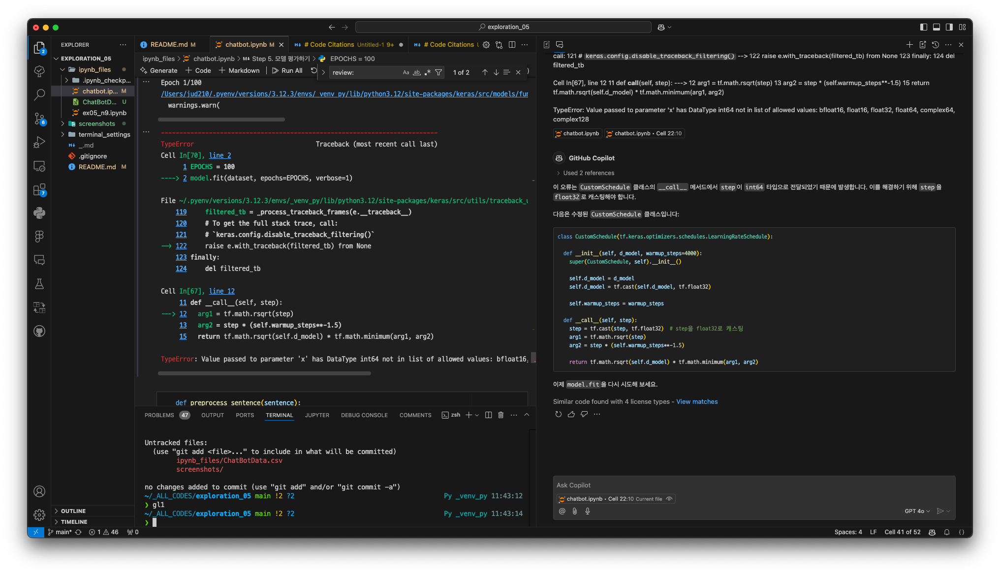

# Exploration 05 Project - 권오근, 이동수, 민혁

## 팁 공유

- 참고하면 좋은 사이트 (LMS 작성자의 원본 ebook)
  - <https://wikidocs.net/31379>

## 문제 및 해결

종결 코드: chatbotshit.ipynb (by 오근킹)

### 문제 0



원인

- PositionalEncoding 레이어에서 SparseTensor를 연산하려고 할 때 발생하는 문제입니다.

해결

- 데이터셋 변환 시 Dense 보장 (모델에 들어가는 입력이 SparseTensor로 변환되지 않도록 보장하는 것)
- Input Layer에서 명시적으로 sparse=False 지정
- PositionalEncoding 내부에서 처리 (비추천) <- 이건 적용안함

### 문제 1



원인

- tf.sparse.is_sparse() 라는 함수나 속성이 TensorFlow 2.x에서 더 이상 제공되지 않는 것에서 비롯됩니다.
- 과거 TensorFlow 1.x에서는 tf.sparse.is_sparse()가 존재했지만, 2.x에서는 이를 사용할 수 없습니다.
- 대신, TensorFlow에서는 tf.sparse 모듈 내 연산을 사용하려면 주어진 텐서가 tf.SparseTensor 타입인지 직접 확인하는 방식을 사용합니다.

해결

- tf.sparse.is_sparse()는 사용 불가능합니다.
- 대신 isinstance(tensor, tf.SparseTensor)를 사용하여 SparseTensor 여부를 확인합니다.
- 이를 통해 SparseTensor일 경우 tf.sparse.to_dense()로 변환하는 로직을 적용했습니다.

### 문제 2



원인

- 해당 오류는 실제 y_true(타겟)와 y_pred(모델 출력)의 시퀀스 길이 차이에서 비롯됩니다. 에러 메시지를 자세히 보면 다음과 같습니다.
- 39 , 40 문제.

해결

- loss_function에서 불필요한 reshape 제거
- dec_inputs와 outputs의 길이가 39로 동일하게 유지되는지 확인
- 필요하다면 loss_function 내에서 y_pred를 y_true 길이에 맞게 슬라이싱 (임시 방편)

### 문제 3



원인

- 현재 CustomSchedule 클래스의 __call__ 메서드에서 step은 int64 형태로 들어옵니다.
- tf.math.rsqrt 및 tf.math.minimum 등 부동소수점 연산은 float형 입력을 기대합니다.
- 따라서 step을 float32로 캐스팅해줘야 합니다.

해결

- CustomSchedule 클래스의 __call__ 메서드에서 step을 tf.cast(step, tf.float32)로 변환함으로써 int64에서 float32 타입으로 맞춰주었습니다.
- 이로써 tf.math.rsqrt 함수 호출 시 데이터 타입 문제를 해결할 수 있습니다.

## 코더 회고

- 배운 점
  - 권오근:
  - 이동수:
  - 민혁:

- 아쉬운 점
  - 권오근:
  - 이동수:
  - 민혁:

- 느낀 점
  - 권오근:
  - 이동수:
  - 민혁:

- 어려웠던 점
  - 권오근:
  - 이동수:
  - 민혁:

## 피어리뷰 템플릿

- 리뷰어:

- [ ]  __1. 주어진 문제를 해결하는 완성된 코드가 제출되었나요? (완성도)__
  - 문제에서 요구하는 최종 결과물이 첨부되었는지 확인
  - 문제를 해결하는 완성된 코드란 프로젝트 루브릭 3개 중 2개,
    퀘스트 문제 요구조건 등을 지칭
    - 해당 조건을 만족하는 부분의 코드 및 결과물을 캡쳐하여 사진으로 첨부

- [ ]  __2. 프로젝트에서 핵심적인 부분에 대한 설명이 주석(닥스트링) 및 마크다운 형태로 잘 기록되어있나요? (설명)__
  - [ ]  모델 선정 이유
  - [ ]  하이퍼 파라미터 선정 이유
  - [ ]  데이터 전처리 이유 또는 방법 설명

- [ ]  __3. 체크리스트에 해당하는 항목들을 수행하였나요? (문제 해결)__
  - [ ]  데이터를 분할하여 프로젝트를 진행했나요? (train, validation, test 데이터로 구분)
  - [ ]  하이퍼파라미터를 변경해가며 여러 시도를 했나요? (learning rate, dropout rate, unit, batch size, epoch 등)
  - [ ]  각 실험을 시각화하여 비교하였나요?
  - [ ]  모든 실험 결과가 기록되었나요?

- [ ]  __4. 프로젝트에 대한 회고가 상세히 기록 되어 있나요? (회고, 정리)__
  - [ ]  배운 점
  - [ ]  아쉬운 점
  - [ ]  느낀 점
  - [ ]  어려웠던 점

- [ ]  __5.  앱으로 구현하였나요?__
  - [ ]  구현된 앱이 잘 동작한다.
  - [ ]  모델이 잘 동작한다.

## 리뷰어 회고(참고 링크 및 코드 개선)

```Plaintext

```
